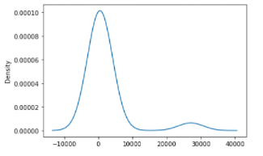
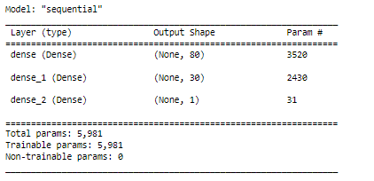

# Neural Network Charity Analysis

## Project Overview
By utilizing neural network models, we can analyze financial data for a non-profit philanthropic organization called Alphabet Soup to decide which donations are most impactful. This data can help plan which organizations should receive future donations to make the best use of Alphabet Soup's money. 

## Results
The initial neural network model only had an accuracy of 64%. Knowing that this could be improved, the next task was optimizing the model to improve accuracy. Three attempts were made to do this, including adding additional layers and neurons, changing the activation function of the layers, and removing noisy variables. The attempts were ultimately not successful in improving the accuracy (ranging from 32%-58% for the three attempts), but this at least helps know what future attempts should focus on and what changes would not prove beneficial. 

- Data Preprocessing

    - The target variable of this model is success, which is determined by whether or not the money donated was used effectively or not (found in the IS_SUCCESSFUL column).

    - The features variables of this model are Application Type, Affiliation, Classification, Use Case, Organization, Status, Income Amount, Special Considerations, and Ask Amount. Application Type and Classification were split into bins, with the most rare categories being lumped together as "other." Using a density plot (seen below), Application Type was filtered from 17 different groups to 9, and Classification was filtered from 71 to 6 groups. 

    

    - Other variables (neither targets nor features) that should be removed include EIN and the Name of the organization. 

- Compiling, Training, and Evaluating the Model

    

    - My model started with two hidden layers and one output layer. ReLu was used for the hidden layers and Sigmoid was used for the output layer. The first hidden layer had 80 neurons and the second had 30 neurons. Having more neurons in earlier layers will often result in better performance than the other way around. This resulted in 5981 trainable parameters. I did not want to begin with too many layers or neurons and lead the model toward overfitting, decreasing overall accuracy, so I started with a middle-ground and decided that I could increase or decrease these during the optimization phase. 
  
    - Ultimately, I did not increase model performance. All attempts resulted in lower performance (from 32% to 58%, compared to original 64%).

    - To increase model performance, I first attempted to increase the number of layers (adding one) and increase the number of neurons per layer (from 80|30 to 120|80|30). This halved the accuracy from 64% to 32%. Next, I attempted to change the activation functions for each layer (from ReLu|ReLu|Sigmoid to ReLu|Sigmoid|Tanh). Again, the model performance decreased, this time to 47%. Finally, I revisited the variables used and decided to drop data for Special Considerations, Use Case, and Affiliation, hoping that these were noisy interference detracting from our model's accuracy. With 30 columns insetad of 43 (variables were one-hot encoded so this is not representing that many variables, just total bins for all variables), this resulted in the closest performance, but still decreased from 64% to 58% accuracy. 

## Summary
Using neural network models, I designed a model to predict how effectively donated money is being used based on an organization's metrics or the details of their application. This was effective over half of the time, but failed to account for a large portion of the variation and would likely not be effective in approving grants, as randomly picking the applications and deciding with a coin flip would yield similar accuracy. The efforts to improve the model did not yield successful, but that does not mean we should stop trying. 

Future analysis could involve an ensemble classifier like random forests in order to focus on multi-variate classification. This would likely result in a model increased accuracy as a random forest classifier would be better suited for this type of data. A neural network was not necessarily the best fit for this data and number of features. 